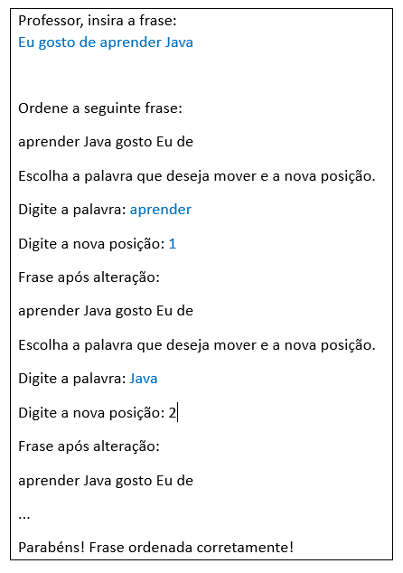
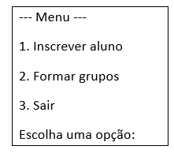

# Lab 8 - Introdução às Coleções e Tipos Genéricos

## Aplicações Java 

:dart: Desenvolva os seguintes programas com recurso ao IDE `IntelliJ IDEA`.

:warning: Crie os diferentes exercícios em projetos separadas.

:warning: Não se esqueça de guardar o seu trabalho!  

## Exercícios :pen:

1. Um dos exercícios mais comuns quando se está a aprender uma língua estrangeira é a colocar as palavras na ordem correta, de uma frase que se encontra desordenada. Escreva um programa em Java que simule esta atividade de aprendizagem. 
    📝 Para tal, deve considerar as seguintes operações:

    - Escrever uma frase, por parte do professor.
    - Armazenar a frase numa instância de   `List<String>`.
    - Baralhar as palavras da frase.
    - Mostrar a frase desordenada.
    - Solicitar ao aluno para introduzir a palavra que pretende mudar de posição e a nova posição onde quer colocar essa palavra.
        :warning: Considere a primeira palavra na posição 1, seguindo depois a sequência.
    - A cada mudança de posição deve ser mostrada novamente a frase desordenada.
    - Este processo só deverá terminar quando a frase desordenada fica igual à original.

      :desktop_computer: Exemplo de resultado esperado:

    

---

2. Considere uma turma de laboratório em que os alunos são identificados pelo seu número. Inicialmente a turma está vazia. 

   Deverá ser possível:
   
   - Solicitar ao professor para inscrever cada aluno na turma. 
     :warning: A capacidade máxima do número de alunos da turma deverá ser fixado inicialmente. 
   - Distribuir os alunos em grupos de 2, de forma aleatória. 
     :warning: Se a turma tiver número ímpar de alunos inscritos, o último grupo deverá ficar com 3 elementos.
   - Após a formação dos grupos, cada grupo deve ser listado e os alunos devem ser apresentados de forma ordenada.  
   
   📝 Escreva um programa em Java que simule o funcionamento desta turma de laboratório. Para tal, deve considerar as seguintes operações:
   
- Solicitar a capacidade máxima da turma.
   
- Criar a estrutura para armazenar os alunos.  
   
   - Criar um menu simples para o professor gerir a turma e formar grupos.
   
     
   
   - Inscrever alunos fornecendo um número único. Caso o aluno já esteja inscrito, o programa impede a duplicação.
   
- Baralhar os alunos para criar grupos aleatórios. 
   
- Formar grupos com dois alunos. Se o número de alunos for ímpar, o último grupo terá três alunos.
   
- Listar os alunos de cada grupo de forma ordenada. 

---
paula.miranda@estsetubal.ips.pt e bruno.silva@estsetubal.ips.pt

